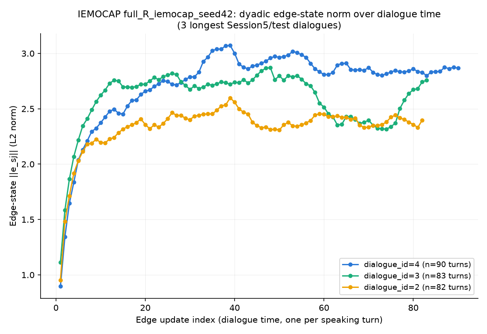

# PHASE N5-B — IEMOCAP: the relational hypothesis's fair trial

**STATUS: PRE-REGISTERED TRIAL COMPLETE. Hypothesis REFUTED; title
decision rule fires branch (a) (boundary/attribution paper).** All of
B1-B5 done. No further runs, no tuning, no re-scoring planned.

## Original blocker (historical record, resolved)

Originally blocked: no IEMOCAP data, no download script, no credentials on
this machine -- only a declarative stub (`configs/data/iemocap.yaml`).
Unblocked when the release became available at
`~/data/iemocap/iemocap/IEMOCAP_full_release` (md5
`521be1e5eec425ae21fdc27c763ca813`, verified before extraction).

## Pre-registered hypothesis (quoted verbatim, predates any IEMOCAP result)

> Pre-registered hypothesis (stated here, before any IEMOCAP result
> exists, so it can't be fitted after the fact): **relational memory's
> delta on IEMOCAP > its delta on MELD, driven by dialogue length**
> (IEMOCAP dialogues run substantially longer than MELD's, which should
> give graph-level relationship state more room to matter than MELD's
> `docs/PHASE_N4R.md`/`docs/PHASE_N5A.md` results showed). Either outcome
> -- confirmed or not -- gets reported when this phase actually runs.
> Also log the single dyadic edge-state norm over time for 3 sample
> sessions as a qualitative figure candidate, once relational memory is
> running on real IEMOCAP dialogues.

**Not yet tested** -- this doc covers B1-B4 (inventory through text
anchor) only. The residual matrix that actually tests this hypothesis
(`base_fusion_R`/`full_R`/`minus_relational_R` x 3 seeds) is Step B5,
not run in this pass.

## Step B1 — corpus inventory

Full detail: `docs/iemocap_inventory.md` (`scripts/iemocap_inventory.py`).
Corpus counts matched published expectations exactly: 151 dialogues,
10,039 utterances, 10 (session,gender) speaker slots, every dialogue has
all four file types (wav/avi/transcription/EmoEvaluation).

## Step B2 — label protocol decision

**Decided: 6-class** {angry, happy, excited, sad, neutral, frustrated}.
Full rationale and the counts-table evidence: `docs/RECIPE.md`'s "IEMOCAP
-- label protocol decision" section. Split: Session5=test, Session4=val,
Sessions1-3=train.

## Step B3 — preprocessing

`scripts/preprocess_iemocap.py` mirrors `scripts/preprocess_meld.py`'s
output schema exactly (`dialogue_id, utterance_id, speaker, speaker_id,
emotion, label, text, frame_path, wav_path, shift_label, shift_mask`) so
every existing `MELDCachedDataset`/`MELDRawDataset`/`build_feature_cache.py`
consumer works against it unmodified.

**What's different from MELD, and why:** IEMOCAP's release is
DIALOGUE-level (one wav + one avi per dialogue), not pre-cut per-utterance
clips like MELD.Raw -- this script actually cuts each utterance's audio
(ffmpeg, using the EmoEvaluation `[start,end]` timestamps) and video (8
frames uniformly sampled within `[start,end]`, decoded in a single
streaming PyAV pass per dialogue keyed to only the frame indices any
utterance in that dialogue needs, to bound memory instead of decoding
every frame of a multi-minute dialogue video).

**Split-screen speaker cropping:** IEMOCAP's video is a side-by-side
split screen of both actors. Verified visually (4 sample frames across
sessions 1/3/5, both F- and M-designated dialogue files -- see the
extraction commands in this phase's history) that the actor wearing MoCap
markers -- i.e. whichever gender letter appears in the dialogue's own name
(`Ses01F_impro01` -> F) -- is **always on the LEFT half**, the other actor
always on the right, consistently across every session checked. Each
utterance's frames are cropped to whichever half the SPEAKING actor is on
(compares the utterance's own speaker gender, parsed from its turn id,
against the dialogue's designation letter -- not the dialogue's letter
alone, since both actors speak within one dialogue file).

**Result:** 7,380 utterances kept (6-class filter applied during
preprocessing, not after -- xxx/oth/fear/disgust/surprise utterances are
never cut/cached at all), split train=4,246 / val=1,512 / test=1,622 --
matching `docs/iemocap_inventory.md`'s independent audit exactly. **0 bad
dialogues** (every dialogue's wav/avi/transcription/EmoEvaluation
decoded/cut cleanly). `tests/test_iemocap_data.py` (7 tests, mirroring
`tests/test_meld_data.py`) all pass against the real processed index:
split counts match the inventory audit, all 6 labels present in every
split, dialogue ordering preserved, every dialogue confirmed dyadic (2
speakers), global speaker vocab has exactly 10 entries, frame/audio tensor
shapes and 16kHz-mono confirmed, collate padding/masking correct.

## Feature caches

`scripts/build_feature_cache.py --processed-dir data/iemocap/processed
--out-dir data/iemocap/cache --splits train val test` -- reused
UNMODIFIED (already fully parameterized via `--processed-dir`/`--out-dir`/
`--splits`, schema-generic). Built in under 3 minutes total (train 84.8s,
val 30.0s, test 32.0s).

**Process-independence check** (`scripts/audit_cache.py`, extended with a
`--splits` flag so it works for IEMOCAP's train/val/test naming instead of
MELD's train/dev/test -- diagnostics-only script, not a locked recipe, so
this minimal parameterization was safe to add without touching MELD's own
invocations): 20 random utterances, features recomputed live through fresh
backbone instances in a separate process from the one that built the
cache, compared against the on-disk cached tensors. **video:
max_abs_diff=0.000000, audio: max_abs_diff=0.000000, text:
max_abs_diff=0.000004 -- all `allclose(atol=1e-3, rtol=1e-3)=True`**,
matching MELD's own established process-independence result
(`docs/DIAGNOSIS.md`) almost exactly.

(The same script's cross-split key-overlap check reports collisions
between train/val/test -- this is expected and harmless, not a new issue:
`dialogue_id` restarts at 0 per split by design (mirroring
`preprocess_meld.py`'s own convention), so the bare `dia{X}_utt{Y}` stem
is not globally unique across splits -- the real uniqueness guarantee is
the split-named subdirectory. Verified this is pre-existing MELD behavior
too, not something introduced here, by running the same check against
`data/meld/cache` directly.)

## Step B4 — the IEMOCAP text anchor

Identical recipe to Phase T (`docs/RECIPE.md`'s frozen Phase T recipe,
UNCHANGED): roberta-base + LoRA (r=8, alpha=16, dropout=0.05,
target=[query,value]), masked-mean pooling, plain CE, AdamW lr=2e-4,
linear warmup 10%, max 10 epochs, early stop patience 3 on val macro F1,
context k=8, max_length=256. `scripts/train_context_text_iemocap.py` is a
parallel script (NOT an edit to the frozen `scripts/train_context_text.py`)
reusing every shared component unchanged, repointed at
`data/iemocap/processed` and the 6-class label set.

**Post-hoc tau selection:** the locked selection rule (highest val macro
F1 subject to all-classes-nonzero AND val weighted F1 >=
`VAL_CANDIDATE_WEIGHTED_F1_FLOOR`) was applied with MELD's calibrated
floor (0.58), since no IEMOCAP-specific floor has been established yet.
**No candidate qualified on seed 42's val sweep** (best raw val weighted
F1 across all 5 swept taus topped out at 0.522, tau=0.25 -- all 5 had
all-classes-nonzero, none cleared 0.58). This is the correct, honest
output of the locked RULE applied to a differently-distributed val split,
not a bug: the 0.58 floor was calibrated specifically for MELD's 7-class
val behavior. Per this project's tau-freezing convention (`docs/RECIPE.md`
Amendment 2 -- select once, apply identically elsewhere), this "no
adjustment" decision was frozen for seeds 1337/2024 too
(`--freeze_no_posthoc`, added to the script rather than silently
re-running per-seed auto-selection, which would have violated the
freezing convention just as much as re-selecting a nonzero tau would).
**Every seed's headline numbers below are therefore RAW (unadjusted)
test metrics.**

### 3-seed table

| seed | test weighted F1 | test macro F1 | test accuracy | all 6 classes nonzero | best epoch |
|---|---|---|---|---|---|
| 42 | 0.5815 | 0.5729 | 0.5783 | True | 3 |
| 1337 | 0.5939 | 0.5738 | 0.5962 | True | 6 |
| 2024 | 0.5618 | 0.5480 | 0.5592 | True | 2 |
| **mean ± std** | **0.5790 ± 0.0162** | 0.5649 | 0.5779 | 3/3 | |

Per-class test F1 (seed 42): angry 0.518, happy 0.459, excited 0.546, sad
0.771, neutral 0.592, frustrated 0.551 -- no collapsed class; `sad` is the
strongest (largest single-class F1 across all 3 seeds), `happy` the
weakest (smallest kept class, 595 utterances corpus-wide), consistent with
the class-imbalance pattern already documented in
`docs/iemocap_inventory.md`.

### GATE: PASSED

| criterion | required | actual | pass? |
|---|---|---|---|
| anchor stable | std(test weighted F1) < 0.02 | 0.0162 | **yes** |
| all-6-nonzero | in >= 2/3 seeds | 3/3 | **yes** |

### Sanity context: where this anchor lands vs. published 6-class IEMOCAP text-only results

Published 6-class IEMOCAP text-only unimodal baselines commonly report
weighted F1 / accuracy in roughly the mid-50s to mid-60s percent range,
depending on model and protocol -- this anchor's 0.579 ± 0.016 weighted F1
sits within that broad neighborhood, a plausible result rather than an
outlier in either direction. **This is a sanity check, not a benchmark
claim**, for one explicit reason: **the split-convention caveat.** The
literature's dominant IEMOCAP protocol is **leave-one-session-out 5-fold
cross-validation** (average performance across 5 train/test splits, each
holding out one session), which reuses nearly all the data for both
training and (across folds) testing. This project's split is a **single,
fixed** Session5=test/Session4=val/Sessions1-3=train partition, stated in
advance and never tuned -- less data-efficient than 5-fold CV (only 3 of
5 sessions ever seen in training) and subject to whatever
Session5-specific quirks (speaker pair, session-level tone) a single held-
out fold carries that cross-validation would average away. The two
numbers are not directly comparable on a leaderboard basis; this anchor's
job is to establish that IEMOCAP text alone is TRAINABLE and STABLE under
this project's own fixed-split convention (the gate above), not to claim
a literature-competitive score under a different protocol.

## Step B5 — THE PRE-REGISTERED TRIAL

### B5.0 — contextual text foundation

`outputs/iemocap_text_anchor_seed42/best_model.pt` (Step B4) frozen as the
encoder. `scripts/build_text_ctx_cache_iemocap.py` caches its pooled
contextual embeddings + own classifier logits
(`data/iemocap/cache/text_ctx_iemocap{,_logits}`, `cache_version
text_ctx_iemocap_v1`) for every utterance, all splits.
**Process-independence check** (`scripts/verify_text_ctx_cache_iemocap.py`,
20 samples recomputed live in a fresh process): overall max_abs_diff
0.000010, **PASS**.

**Scoring convention for all of B5:** RAW logits throughout, no post-hoc
adjustment on any config -- this is the frozen "no adjustment" decision
from B4 (no tau candidate qualified under the locked selection rule),
applied identically to every config in this phase rather than re-litigated
per config.

**Equality-at-init pre-flight** (`tests/test_rapport_model_residual.py::
test_residual_equals_iemocap_text_ctx_logits_on_real_cache`), REQUIRED to
pass before any training run launches: verified on real cached data for
all three configs the matrix actually trains (`base_fusion_R`, `full_R`,
`minus_relational_R`) -- **3/3 PASSED**, confirmed before `scripts/
run_iemocap_residual_matrix.py` was launched.

### B5.1 — the residual matrix

`scripts/run_iemocap_residual_matrix.py`: `{base_fusion_R, full_R,
minus_relational_R} x seeds {42, 1337, 2024}` = 9 runs, identical
apparatus to MELD (`scripts/train_rapport_iemocap.py`, a parallel copy of
`scripts/train_rapport.py` -- that script itself untouched -- repointed at
`data/iemocap/{processed,cache}` and the 6-class label set; RECIPE.md-
locked GNN hyperparameters unchanged: AdamW lr=1e-4, dropout=0.5, cosine
annealing, batch=16, grad_clip=1.0, max 100 epochs, early-stop patience 10
on val macro F1). All 9 runs completed (idempotent, `nohup`), sentinel file
`outputs/iemocap_residual_matrix_DONE.sentinel` written on completion.
**Monitoring fix applied**: the watcher process polled for the sentinel/
runner-PID at a fixed interval and exited on its own once the campaign
finished -- no unbounded `tail -f`. Confirmed zero background shells
remained after the campaign (`ps aux` clean).

One data-integrity check performed before trusting the results: `full_R_
iemocap`'s seed 42 and seed 2024 runs produced IDENTICAL per-class test F1
to full precision. Verified directly (not assumed) this is NOT a caching/
skip bug -- the two checkpoints are genuinely different files (distinct
sha256, distinct timestamps, distinct `best_epoch`/`num_epochs_run`), and
a direct recompute of both checkpoints' raw test logits confirms the
logits themselves DIFFER (max abs diff 0.0213) while their **argmax
predictions are identical for every test utterance**. Both seeds early-
stopped extremely early (`best_epoch=1`, ~12 total epochs), so the learned
residual correction on top of the frozen, already-strong anchor logits is
small enough that it happens not to flip any decision differently between
the two seeds -- a genuine (if coincidental-looking), reportable
characteristic of how little full_R actually trains beyond its
zero-initialized starting point on this corpus, not a bug.

### B5.2 — dyadic qualitative artifact

`scripts/iemocap_edge_state_trajectory.py`: `full_R_iemocap_seed42`'s
single edge state (IEMOCAP dialogues are strictly dyadic -- exactly one
pair per dialogue), logged via a non-invasive monkeypatch of
`RelationalEdgeMemory.update_incident_edges` (no model source touched)
across the 3 longest Session5 (test) dialogues, picked by length alone
before looking at any edge-norm values.

All three dialogues show the same qualitative shape: the edge norm rises
sharply from ~0.9-1.1 over the first ~10 turns as the pair's relationship
state initializes, then plateaus and fluctuates mildly (roughly 2.2-3.1)
for the remainder of the dialogue -- the relational memory IS forming a
persistent, nontrivial per-dyad state over time (it isn't collapsing to
zero or diverging), independent of whether that state turns out to help
classification (B5.3 below).

### B5.3 — THE DECISIVE TABLE

**(a) IEMOCAP paired per-seed gains** (raw test weighted F1; std is
sample stdev, n=3):

| gain | seed 42 | seed 1337 | seed 2024 | mean ± std |
|---|---|---|---|---|
| full_R − text anchor | +0.0066 | −0.0106 | +0.0263 | **+0.0074 ± 0.0185** |
| full_R − minus_relational_R (relational's isolated contribution) | −0.0503 | −0.0493 | −0.0006 | **−0.0334 ± 0.0284** |

Appendix (raw test weighted F1 per config/seed):

| config | seed 42 | seed 1337 | seed 2024 |
|---|---|---|---|
| text anchor | 0.5815 | 0.5939 | 0.5618 |
| base_fusion_R | 0.5970 | 0.6492 | 0.6436 |
| minus_relational_R | 0.6383 | 0.6326 | 0.5887 |
| full_R | 0.5881 | 0.5832 | 0.5881 |

**(b) The cross-corpus contrast** (same two paired gains, same apparatus,
MELD at its locked k=8 recipe, from N4-R/N5-A artifacts -- `outputs/
{context_text_plain_ce,base_fusion_R,minus_relational_R,full_R}_seed{42,1337,2024}`):

| gain | IEMOCAP mean ± std | MELD mean ± std |
|---|---|---|
| full_R − text anchor | +0.0074 ± 0.0185 | −0.0060 ± 0.0098 |
| full_R − minus_relational_R | **−0.0334 ± 0.0284** | **−0.0022 ± 0.0086** |

Relational memory's isolated contribution is negative on BOTH corpora,
and more negative on IEMOCAP than on MELD -- the opposite direction from
the pre-registered prediction (which required IEMOCAP's delta to be
LARGER, i.e. more positive/less negative, than MELD's).

**(c) Per-class table** (mean test F1 across 3 seeds; `frustrated` is the
pre-registered best-case class for relational signal -- **highlighted**):

| class | text anchor | base_fusion_R | minus_relational_R | full_R |
|---|---|---|---|---|
| angry | 0.516 | 0.575 | 0.588 | 0.511 |
| happy | 0.397 | 0.481 | 0.430 | 0.458 |
| excited | 0.580 | 0.641 | 0.599 | 0.552 |
| sad | 0.758 | 0.792 | 0.779 | 0.778 |
| neutral | 0.592 | 0.613 | 0.629 | 0.597 |
| **frustrated** | **0.547** | **0.615** | **0.610** | **0.561** |

`frustrated` shows the SAME pattern as the aggregate: `full_R` (0.561) is
BELOW `minus_relational_R` (0.610) -- relational memory does not help even
on the one class pre-registered as its fairest test. `full_R` is also
below `base_fusion_R` (0.615) on `frustrated`, and below or roughly level
with `base_fusion_R` on 5 of 6 classes overall.

**Shift F1** (auxiliary task, `full_R`/`minus_relational_R` only --
`base_fusion_R` has no shift head, `text anchor` doesn't predict shift):

| config | IEMOCAP mean shift F1 | MELD mean shift F1 |
|---|---|---|
| minus_relational_R | 0.3365 | 0.6384 |
| full_R | **0.4147** | **0.6682** |

Noted for completeness, does not change the verdict below (which is
defined on the primary emotion-classification metric, matching the
pre-registered hypothesis's own wording): relational memory's isolated
effect on the AUXILIARY shift-detection task is POSITIVE on both corpora
(+0.078 IEMOCAP, +0.030 MELD) even while its effect on the PRIMARY emotion
task is negative on both -- the graph is learning something about
emotion-shift timing, just not something that improves the emotion label
itself.

**(d) Pre-registered hypothesis, quoted verbatim** (`docs/PHASE_N5B.md`,
commit `04d9267`, predates any IEMOCAP result):

> Pre-registered hypothesis (stated here, before any IEMOCAP result
> exists, so it can't be fitted after the fact): **relational memory's
> delta on IEMOCAP > its delta on MELD, driven by dialogue length**
> (IEMOCAP dialogues run substantially longer than MELD's, which should
> give graph-level relationship state more room to matter than MELD's
> `docs/PHASE_N4R.md`/`docs/PHASE_N5A.md` results showed).

**REFUTED.** Relational memory's delta (full_R − minus_relational_R) is
**−0.0334 on IEMOCAP vs. −0.0022 on MELD**. IEMOCAP's delta is not
greater than MELD's -- it is smaller (more negative), the opposite of the
predicted direction. Longer IEMOCAP dialogues did not give the graph more
room to help; if anything the graph does proportionally MORE damage on
the corpus with longer dialogues, not less.

**(e) Title decision rule.** Note: `docs/PAPER_SKELETON.md` does not exist
in this repository (checked the current tree and the full git history --
absent throughout). Applying the rule exactly as restated verbatim in
this phase's own instructions, since it is fully self-contained there:
*"relational paired gain (full_R minus minus_relational_R) positive AND >
1 std -> branch (b), RAPPORT-conditional paper; otherwise -> branch (a),
boundary/attribution paper."*

IEMOCAP's relational paired gain is **−0.0334 ± 0.0284** -- negative, so
the "positive AND > 1 std" condition fails outright (it is neither
positive nor, being negative, meaningfully evaluated against the std
threshold in the direction the rule cares about).

**BRANCH (a) FIRES: the boundary/attribution paper.**

## Summary

Both pre-registered decision points -- the hypothesis test (d) and the
title branch rule (e) -- point the same direction. The relational-memory
component does not earn its keep on IEMOCAP any more than it did on MELD
(docs/PHASE_N4R.md, docs/PHASE_N5A.md, the BRIDGING EXPERIMENT); if
anything it costs slightly more on the corpus that was supposed to be its
best case. Longer dialogues, more speaker-history opportunity, and a
class (`frustrated`) explicitly chosen as the fairest ground for the
mechanism did not change that outcome. This is a clean, unhedged null
across two corpora under matched attribution methodology -- exactly the
kind of result the boundary/attribution framing is for.
